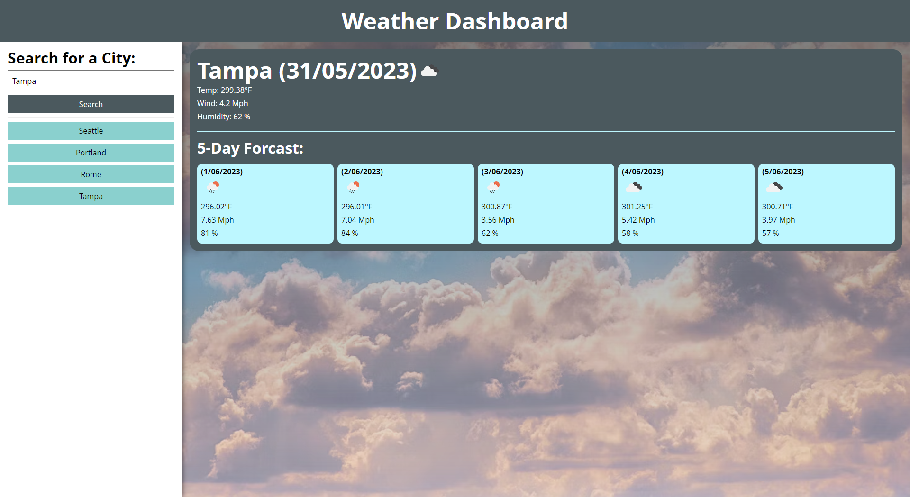

# weather-app-dashboard

## Description

A simple weather forecast app using the OpenWeather API.

Link to live site: https://prettiestrobot.github.io/weather-app-dashboard/

## Instructions

Type in a city. Click search. App will populate the current weather as well as a 5 day forecast. The app will display a search histor under the search input for quick access to previously searched locations.
